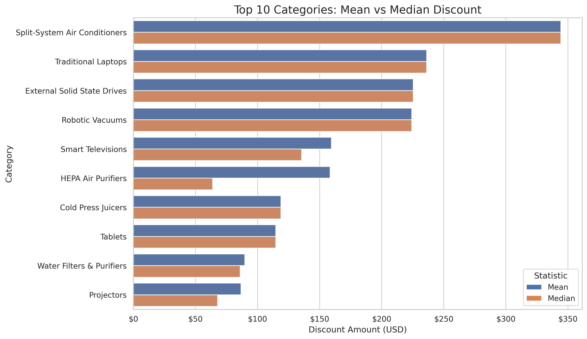
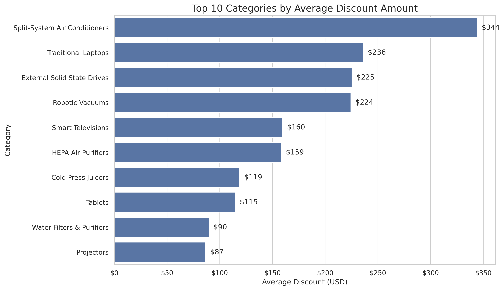

# Amazon Pricing Analysis

This project reviews Amazon pricing data to see how prices and discounts change across product categories.

---

## Overview

I used Python and Pandas to clean the dataset, create discount-related fields, and compare categories. The goal was to understand how discount behavior changes from one category to another.

---

## Work Included

- Cleaned the dataset and fixed formatting issues
- Created columns to measure discount differences
- Compared categories to look for pricing patterns
- Organized the data for easier analysis

---

## Main Findings

- Some categories had higher discounts more often
- Discounts were not spread evenly across all products
- Pricing behavior changed depending on the category

---

## Tools

- Python
- Pandas
- Matplotlib
- Seaborn
  
---

## What I Learned

- Clean data matters as much as the analysis
- Small errors can affect the results
- Breaking the work into steps makes the data easier to understand

## Visualizations

### Mean vs Median Discount by Category

### Top Categories by Average Discount

---

## Project Files

- [View Analysis Notebook](notebooks/amazon_discount_analysis.ipynb)
- [View Dataset](data/amazon.csv)
